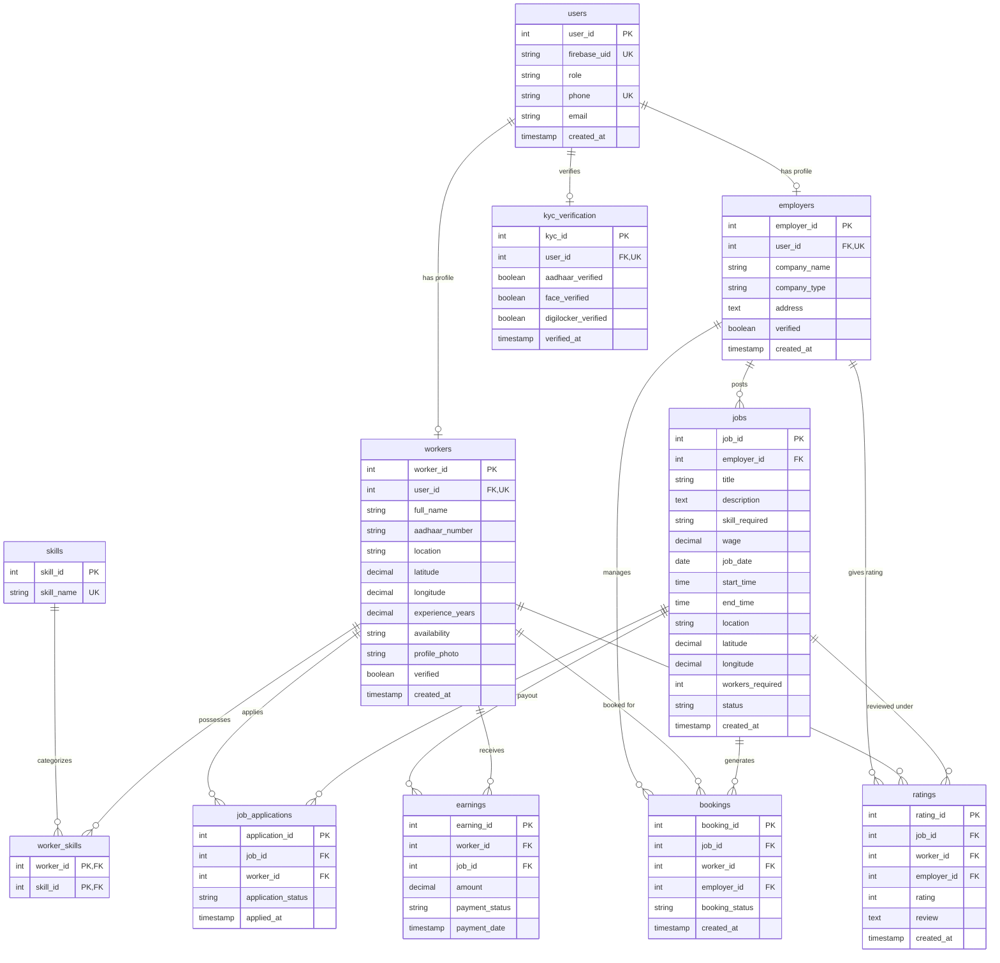

# GigEasy PostgreSQL Database Entity-Relationship Diagram (ERD)

## Entity Relationship Overview

## Summary of Tables

1. **`users`**: Master user authentication table linked to Firebase UIDs and roles (`worker`, `employer`, `admin`).
2. **`workers`**: Worker profile information including geolocation (latitude/longitude), experience, and verification state.
3. **`employers`**: Employer / company details and address.
4. **`skills`**: Master taxonomy of skills (Electrician, Carpenter, Plumber, Painter, Welder, Mason, Helper, Driver).
5. **`worker_skills`**: Junction table mapping workers to their skills.
6. **`jobs`**: Job postings created by employers with location, dates, wages, required skills, and status (`OPEN`, `CLOSED`, `CANCELLED`).
7. **`job_applications`**: Job applications placed by workers (`PENDING`, `ACCEPTED`, `REJECTED`).
8. **`bookings`**: Confirmed/completed bookings connecting job, worker, and employer.
9. **`earnings`**: Financial tracking of payouts and earnings for workers.
10. **`ratings`**: Rating (1 to 5 stars) and qualitative feedback left by employers for workers.
11. **`kyc_verification`**: Multi-factor identity status tracking (Aadhaar, Face, DigiLocker).
